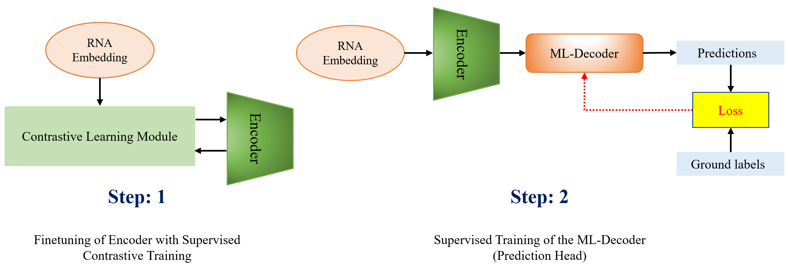

## LOCAS: Multilabel RNA Localization with Supervised Contrastive Learning
Traditional approaches to predicting mRNA subcellular localization often fail to address the complexity of multiple compartmentalization, limiting biological insights. While recent multi-label models have shown progress, challenges persist in accurately capturing intricate localization patterns. We introduce LOCAS (Localization with Supervised Contrastive Learning), a novel framework that in corporates an RNA language model to generate initial embeddings and supervised contrastive learning (SCL) to identify distinct RNA clusters based on sequence similarity. LOCAS also uses a multi-label classification head (ML-Decoder) with cross-attention, enabling accurate multi-compartment predic tions. Our contributions include: (1) the first integration of RNA language models to create a nuanced embedding space for RNA sequences, (2) an SCL approach that detects overlapping localization pat terns with a multi-label similarity threshold, and (3) a multi-label classification head tailored for RNA localization. Comprehensive experiments, including extensive ablation studies and optimized threshold tuning, confirm LOCAS achieves state-of-the-art accuracy across all metrics, setting a new standard in multi-compartment mRNA localization.
### Installation

1. **Clone the repository**:
   ```bash
   git clone https://github.com/abrarrahmanabir/LOCAS.git
   cd LOCAS
   


2. **Install dependencies**:

   ```bash
   pip install torch torchvision tqdm matplotlib pandas numpy scikit-learn
   ```

## Dataset Format
The dataset should have a column 'Sequence' that contains the RNA sequence and the other columns are the locations - 'Chromatin', 'Cytoplasm', 'Cytosol', 'Exosome', 'Membrane', 'Nucleolus','Nucleoplasm' , 'Nucleus', 'Ribosome' and they are one hot encoded.

### How to Train
We give an example dataset named 'dataset.csv' and corresponding language model embeddings in 'dataset.npy'.
To start the training process, execute the following command:

   ```bash
   python train_final.py
```

## How to Run Inference
Run the following command to perform inference with the test dataset 'testsetv2.csv' and corresponding embeddings are in 'test_embeddings.npy'. 

   ```bash
   python inference_final.py
```

### RiNALMo Embedding Generation
Run the following command to generate language model embeddings for any custom dataset. Put the dataset in place of 'dataset.csv' with the required format and it will generate .npy file with the embeddings. You can use it for training or inference. We have provided an example 'dataset.csv' and 'dataset.npy'.

   ```python
   python emb_gen_final.py
```

### Model Architecture



